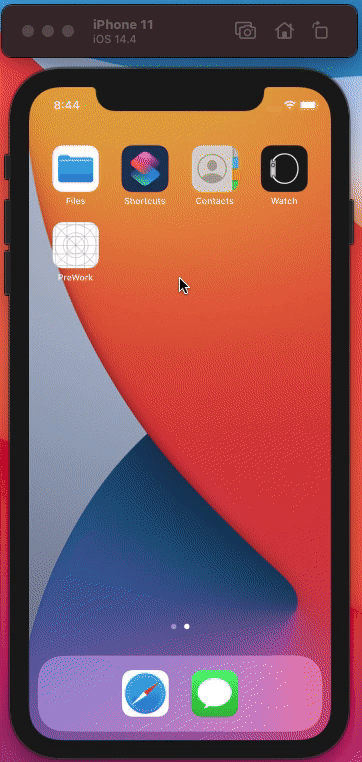

# TipCalculator
### Date : 1/29/2020
### By : William Rai
### Time Spent : 2 days

TipCalculator as it name suggests, calculates the total bill by adding the tip. The application also has a feature of splitting the bill among friends. 

## Background
This is my first ios application. The application is created using Swift as a programming language and storyboard for User Interface. To create this application, I spent a day going through youtube tutorials, apple documentation, stackoverflow and other web searches. During this two day, I gained immense knowledge and ideas for creating ios application. 

The code is not perfect and efficient coding practices may have not been used. This application will be updated and upgraded as I grow my skills in ios and programming. 

### Functionality
- Allows users to enter the total bill
- Automatically calculates the tip and add it to the bill
- Can choose how much tip percentage the user is willing to give
- Can split the bill

### Improvements
- Design flow of the application
- Implement an architecture
- Redesign the User Interface, more user friednly and with good user experience
- Add new screens 
- Add support of different currencies
- Add support of currency conversion

## Challenges
- Learning swift and ios development which was totally new to me
- Designing the application with storyboard, laying out the objects with auto constraint, had to do it over again if needed some change in height or width
- Working with TextField, had difficulty figuring out how to track changes in the textfield
- Making the input of user easy without having to enter dot, found the logic to that in the internet

# DEMO

### Good day :blush:

